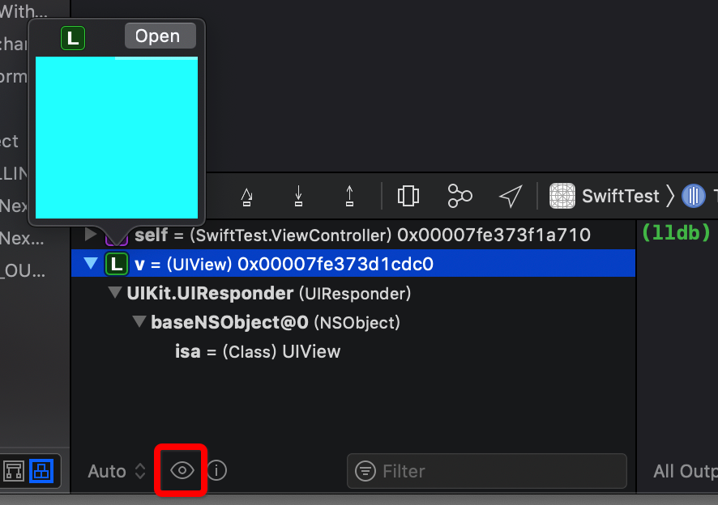
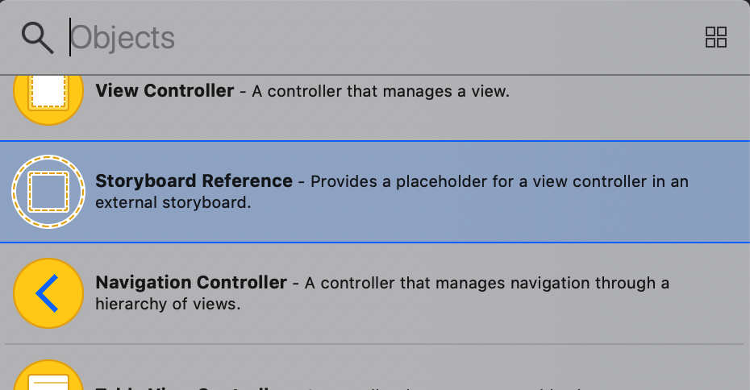

<h2 id="1">1.生成对外暴露的属性和方法</h2>

### 1. 快捷键`⌃⌘↑`和`⌃⌘↓`
日常开发中，我们查看`UIView`对外暴露的属性和方法时，苹果爸爸帮我们把`UIView`的实现过程屏蔽掉了。其实`Xcode`也为我们提供了这样的功能。

* 自动生成`.swift`文件对外暴露的属性和方法的快捷键：`⌃⌘↑`
* 还原到之前的状态：`⌃⌘↓`

生成前：

```swift
class ViewController: UIViewController {
    
    let value1: Int? = nil
    private let value2: Int? = nil
    public let value3: Int? = nil
    
    override func viewDidLoad() {
        super.viewDidLoad()
    }
    
    private func priviteMethod() {}
    public func publicMethod() {}
    open func openMethod() {}
}
```

生成后：

```swift
internal class ViewController : UIViewController {

    internal let value1: Int?

    public let value3: Int?

    override internal func viewDidLoad()

    public func publicMethod()

    open func openMethod()
}
```

<h2 id="2">2.显示Storyboard中控件之间的距离</h2>

按住`⌥`，选择目标控制器，将光标移动到相关控件后会自动显示相对位置。


<h2 id="3">3.重命名当前文件中的方法名或变量名</h2>

选中需要重命名的方法名或变量名，`Editor` > `Refactor` `Rename...`。


一键修改所有的方法名或变量名。

<h2 id="4">4.Storyboard中视图只覆盖不被添加</h2>

在`Storyboard`中拖动控件的时候，按住`⌘`,可以避免控件在叠加的时候，被添加为子控件。


<h2 id="5">5.锁定Storyboard中控件的约束</h2>

我们在用`Storyboard`做控件布局的时候，经常会不小心动了已有的约束，我们可以在`Document`的`Lock`中选择`All Properties`锁定所有的属性。


这样如果不小心动了已经锁住的控件约束也没关系了。

<h2 id="6">6.多重光标操作</h2>

按住`⌥`拖动光标可以进行多重选择操作。

<h2 id="7">7.断点对象预览</h2>


打完断点后，选择需要查看的对象，再点击如下图按钮，就可以看到对象的相关信息了。



<h2 id="8">8.Storyboard解耦</h2>

#### 1. Storyboard拆分
对于比较臃肿的`Storyboard`，我们可以先选中需要拆分的控制器，`Editor` -> `Refactor to Storyboard...`，弹出如下界面


命名好后，原来的`Storyboard`被拆分的部分会变成这样


点击`Other`会跳到对应的`Storyboard`。

#### 2.不同Storyboard中控制器的跳转

`Storyboard`提供了对外部`Storyboard`中控制器的应用，如下图所示。



拖取`Storyboard Reference`控件后，指定对应的`Storyboard`和`控制器`。


将`Storyboard Reference`引用向某一个按钮，点击按钮就可以发生控制器跳转了。


<h2 id="9">9.获取app的启动日志</h2>

给Xcode添加环境变量：`Edit scheme... -> Run -> Arguments -> Environment Variables`

### 1.获取粗略的启动时间分析

添加Name为`DYLD_PRINT_STATISTICS`，Value为`1`

```swift
Total pre-main time: 510.95 milliseconds (100.0%)
    dylib loading time: 121.92 milliseconds (23.8%)
    rebase/binding time: 323.82 milliseconds (63.3%)
    ObjC setup time:  42.40 milliseconds (8.2%)
    initializer time:  22.59 milliseconds (4.4%)
    slowest intializers :
    libSystem.B.dylib :   7.11 milliseconds (1.3%)
```

### 2.获取详细的启动时间分析

添加Name为`DYLD_PRINT_STATISTICS_DETAILS`，Value为`1`

```swift
  total time: 761.18 milliseconds (100.0%)
  total images loaded:  269 (0 from dyld shared cache)
  total segments mapped: 800, into 105090 pages with 7464 pages pre-fetched
  total images loading time: 348.37 milliseconds (45.7%)
  total load time in ObjC:  42.40 milliseconds (5.5%)
  total debugger pause time: 226.45 milliseconds (29.7%)
  total dtrace DOF registration time:   0.19 milliseconds (0.0%)
  total rebase fixups:  2,735,470
  total rebase fixups time: 329.76 milliseconds (43.3%)
  total binding fixups: 287,954
  total binding fixups time:  17.40 milliseconds (2.2%)
  total weak binding fixups time:   0.43 milliseconds (0.0%)
  total redo shared cached bindings time:  23.77 milliseconds (3.1%)
  total bindings lazily fixed up: 0 of 0
  total time in initializers and ObjC +load:  22.59 milliseconds (2.9%)
                         libSystem.B.dylib :   7.11 milliseconds (0.9%)
               libBacktraceRecording.dylib :   1.57 milliseconds (0.2%)
                            CoreFoundation :   0.99 milliseconds (0.1%)
                                Foundation :   1.26 milliseconds (0.1%)
                libMainThreadChecker.dylib :  10.07 milliseconds (1.3%)
total symbol trie searches:    138142
total symbol table binary searches:    0
total images defining weak symbols:  22
total images using weak symbols:  63
```

添加环境变量除了可以打印启动时间日志，还可以打印符号绑定日志，加载的动态库等。具体可以查看
[苹果官方文档](https://developer.apple.com/library/archive/technotes/tn2239/_index.html#//apple_ref/doc/uid/DTS40010638-CH1-SUBSECTION21)


<h2 id="10">10.模拟器录屏</h2>

1. 终端切换到存放视频文件夹
2. 开始录制：`xcrun simctl io booted recordVideo appvideo.mov`
3. 停止录制并保存：`control + c`

这样做可以看不到模拟器的边框。

<h2 id="11">11.AutoLayout约束错误声音提示</h2>

将`-_UIConstraintBasedLayoutPlaySoundOnUnsatisfiable YES`添加到：`Edit scheme... -> Run -> Arguments -> Arguments Passed On Launch`

如果在使用AutoLayout的时候有约束错误会有iPhone低电量提示音。