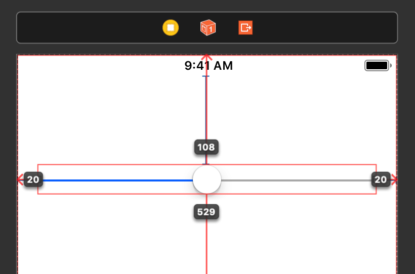
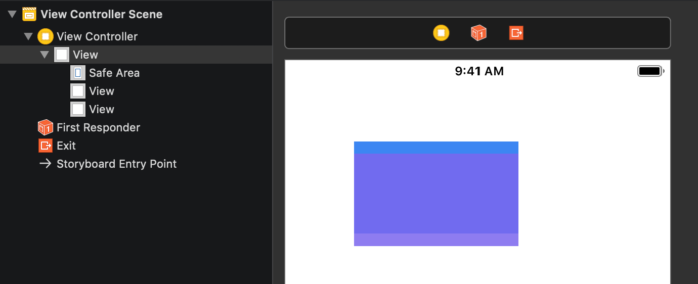
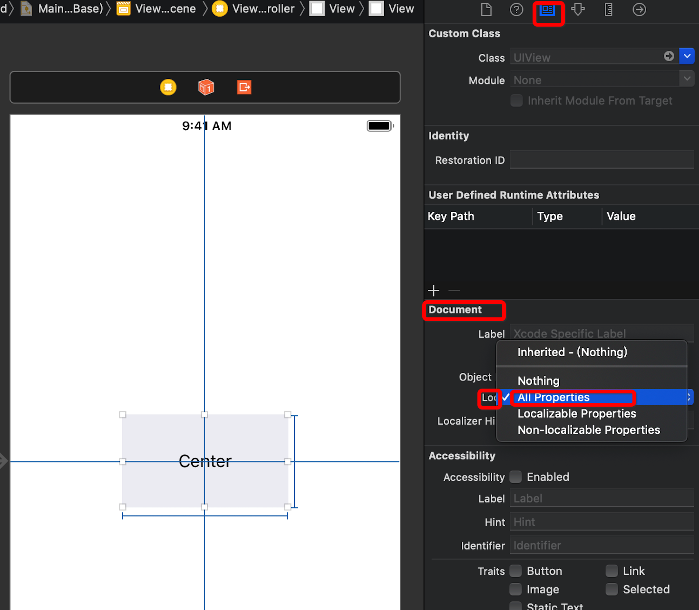

## 1. 生成对外暴露的属性和方法

### 1. 快捷键`⌃⌘↑`和`⌃⌘↓`
日常开发中，我们查看`UIView`对外暴露的属性和方法时，苹果爸爸帮我们把`UIView`的实现过程屏蔽掉了。其实`Xcode`也为我们提供了这样的功能。

* 自动生成`.swift`文件对外暴露的属性和方法的快捷键：`⌃⌘↑`
* 还原到之前的状态：`⌃⌘↓`

生成前：

```swift
class ViewController: UIViewController {
    
    let value1: Int? = nil
    private let value2: Int? = nil
    public let value3: Int? = nil
    
    override func viewDidLoad() {
        super.viewDidLoad()
    }
    
    private func priviteMethod() {}
    public func publicMethod() {}
    open func openMethod() {}
}
```

生成后：

```swift
internal class ViewController : UIViewController {

    internal let value1: Int?

    public let value3: Int?

    override internal func viewDidLoad()

    public func publicMethod()

    open func openMethod()
}
```

## 2. 显示`Storyboard`中控件之间的距离

按住`⌥`，选择目标控制器，将光标移动到相关控件后会自动显示相对位置。



## 3. 重命名当前文件中的方法名或变量名

选中需要重命名的方法名或变量名，`Editor` > `Refactor` `Rename...`。


一键修改所有的方法名或变量名。

## 4. `Storyboard`中视图覆盖，只叠加不添加到对应的子视图

在`Storyboard`中拖动控件的时候，按住`⌘`,可以避免控件在叠加的时候，被添加为子控件。



## 5. 锁定`Storyboard`中控件的约束

我们在用`Storyboard`做控件布局的时候，经常会不小心动了已有的约束，我们可以在`Document`的`Lock`中选择`All Properties`锁定所有的属性。



这样如果不小心动了已经锁住的控件约束也没关系了。

## 6. 多重光标操作

按住`⌥`拖动光标可以进行多重选择操作。

## 7. 断点对象预览

打完断点后，选择需要查看的对象，再点击如下图按钮，就可以看到对象的相关信息了。


## 8. `Storyboard`拆分
对于比较臃肿的`Storyboard`，我们可以先选中需要拆分的控制器，`Editor` -> `Refactor to Storyboard...`，弹出如下界面


命名好后，原来的`Storyboard`被拆分的部分会变成这样


点击`Other`会跳到对应的`Storyboard`。
